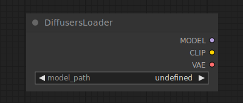

# Diffusers Loader

{ align=right width=450 }

The Diffusers Loader node can be used to load a diffusion model from diffusers.

## inputs

`model_path`

:   path to the diffusers model.

## outputs

`MODEL`

:   The model used for denoising latents.

`CLIP`

:   The CLIP model used for encoding text prompts.

`VAE`

:   The VAE model used for encoding and decoding images to and from latent space.

## example

example usage text with workflow image