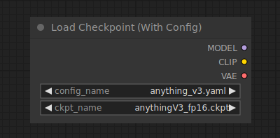

# Load Checkpoint (With Config)

{ align=right width=450 }

The Load Checkpoint (With Config) node can be used to load a diffusion model according to a supplied config file. Note that the regular [load checkpoint](../Loaders/LoadCheckpoint.md) node is able to guess the appropriate config in most of the cases.

## inputs

`config_name`

:   The name of the config file.

`ckpt_name`

:   The name of the model to be loaded.

## outputs

`MODEL`

:   The model used for denoising latents.

`CLIP`

:   The CLIP model used for encoding text prompts.

`VAE`

:   The VAE model used for encoding and decoding images to and from latent space.

## example

example usage text with workflow image