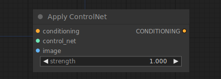

# Apply ControlNet

{ align=right width=450 }

The Apply ControlNet node can be used to provide further visual guidance to a diffusion model. Unlike unCLIP embeddings, controlnets and T2I adaptors work on any model. By chaining together multiple nodes it is possible to guide the diffusion model using multiple controlNets or T2I adaptors. This can be useful to e.g. hint at the diffusion model where the edges in the final image should be by providing an image containing edge detections along with a controlNet trained on edge detection images to this node.

!!! info
    To use the T2IAdaptor style model see the [Apply Style Model](ApplyStyleModel.md) node instead

## inputs

`conditioning`

:   A conditioning.

`control_net`

:   A controlNet or T2IAdaptor, trained to guide the diffusion model using specific image data.

`image`

:   The image used as a visual guide for the diffusion model.

## outputs

`CONDITIONING`

:   A Conditioning containing the control_net and visual guide.

## example

example usage text with workflow image