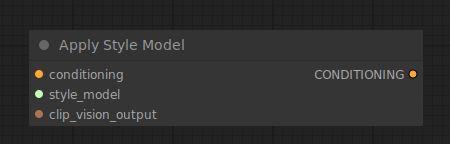

# Apply Style Model

{ align=right width=450 }

The Apply Style Model node can be used to provide further visual guidance to a diffusion model specifically pertaining to the style of the generated images. This node takes the T2I Style adaptor model and an embedding from a CLIP vision model to guide a diffusion model towards the style of the image embedded by CLIP vision.

## inputs

`conditioning`

:   A conditioning.

`style_model`

:   A T2I style adaptor.

`CLIP_vision_output`

:   The image containing the desired style, encoded by a CLIP vision model.

## outputs

`CONDITIONING`

:   A Conditioning containing the T2I style adaptor and visual guide towards the desired style.

## example

example usage text with workflow image