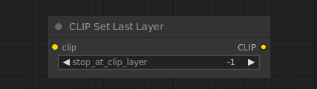

# CLIP Set Last Layer

{ align=right width=450 }

The CLIP Set Last Layer node can be used to set the CLIP output layer from which to take the text embeddings. Encoding text into an embedding happens by the text being transformed by various layers in the CLIP model. Although traditionally diffusion models are conditioned on the output of the last layer in CLIP, some diffusion models have been conditioned on earlier layers and might not work as well when using the output of the last layer.

## inputs

`clip`

:   The CLIP model used for encoding the text.

## outputs

`CLIP`

:   The CLIP model with the newly set output layer.

## example

example usage text with workflow image