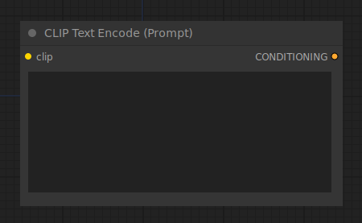

# CLIP Text Encode (Prompt)

{ align=right width=450 }

The CLIP Text Encode node can be used to encode a text prompt using a CLIP model into an embedding that can be used to guide the diffusion model towards generating specific images. For a complete guide of all text prompt related features in ComfyUI see [this](../../Interface/Textprompts.md) page.

## inputs

`clip`

:   The CLIP model used for encoding the text.

`text`

:   The text to be encoded.

## outputs

`CONDITIONING`

:   A Conditioning containing the embedded text used to guide the diffusion model.

## example

example usage text with workflow image