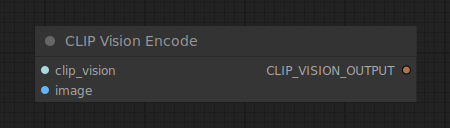

# CLIP Vision Encode

{ align=right width=450 }

The CLIP Vision Encode node can be used to encode an image using a CLIP vision model into an embedding that can be used to guide unCLIP diffusion models or as input to style models.

## inputs

`clip_vision`

:   The CLIP vision model used for encoding the image.

`image`

:   The image to be encoded.

## outputs

`CLIP_VISION_OUTPUT`

:   The encoded image.

## example

example usage text with workflow image