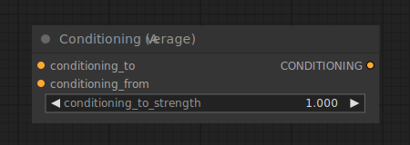

# Conditioning (Average)

{ align=right width=450 }

The Conditioning (Average) node can be used to interpolate between two text embeddings according to a strength factor set in `conditioning_to_strength`.

## inputs

`conditioning_to`

:   The conditioning with the text embeddings at `conditioning_to_strength` of 1.

`conditioning_from`

:   The conditioning with the text embeddings at `conditioning_to_strength` of 0.

`conditioning_to_strength`

:   The factor by which to mix `conditioning_to` into `conditioning_from`.

## outputs

`CONDITIONING`

:   A new conditioning with the text embeddings mixed based on `conditioning_to_strength`.

## example

example usage text with workflow image