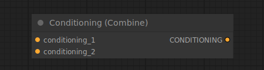

# Conditioning (Combine)

{ align=right width=450 }

The Conditioning (Combine) node can be used to combine multiple conditionings by averaging the predicted noise of the diffusion model. Note that this is different from the [Conditioning (Average)](ConditioningAverage.md) node. Here outputs of the diffusion model conditioned on different conditionings (i.e. all parts that make up the conditioning) are averaged out, while the Conditioning (Average) node interpolates the text embeddings that are stored inside the conditioning.

!!! tip
    Even though Conditioning Combine does not have a factor input to determine how to interpolate the two resulting noise predictions, the [Conditioning (Set Area)](ConditioningSetArea.md) node can be used to weight the individual conditionings before combining them.

## inputs

`conditioning_1`

:   The First conditioning.

`conditioning_2`

:   The second conditioning.

## outputs

`CONDITIONING`

:   A new conditioning containing both inputs, later to be averaged by the sampler.

## example

example usage text with workflow image