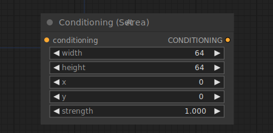

# Conditioning (Set Area)

{ align=right width=450 }

The Conditioning (Set Area) node can be used to limit a conditioning to a specified area of the image. Together with the [Conditioning (Combine)](ConditioningCombine.md) node this can be used to add more control over the composition of the final image.

!!! info
    The origin of the coordinate system in ComfyUI is at the top left corner.

!!! info
    `strength` is normalized before mixing multiple noise predictions from the diffusion model. 

## inputs

`conditioning`

:   The conditioning that will be limited to an area.

`width`

:   The width of the area.

`height`

:   The height of the area.

`x`

:   The x coordinate of the area.

`y`

:   The y coordinate of the area.

`strength`

:   The weight of the area to be used when mixing multiple overlapping conditionings.

## outputs

`CONDITIONING`

:   A new conditioning limited to the specified area.

## example

example usage text with workflow image