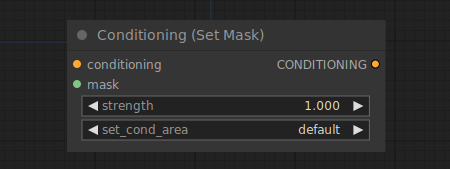

# Conditioning (Set Mask)

{ align=right width=450 }

The Conditioning (Set Mask) node can be used to limit a conditioning to a specified mask. Together with the [Conditioning (Combine)](ConditioningCombine.md) node this can be used to add more control over the composition of the final image. 

!!! info
    `strength` is normalized before mixing multiple noise predictions from the diffusion model. 

## inputs

`conditioning`

:   The conditioning that will be limited to a mask.

`mask`

:   The mask to constrain the conditioning to.

`strength`

:   The weight of the masked area to be used when mixing multiple overlapping conditionings.

`set_cond_area`

:   Whether to denoise the whole area, or limit it to the bounding box of the mask.

## outputs

`CONDITIONING`

:   A new conditioning limited to the specified mask.

## example

example usage text with workflow image