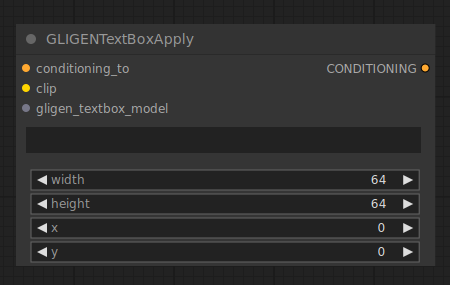

# GLIGEN Textbox Apply

{ align=right width=450 }

The GLIGEN Textbox Apply node can be used to provide further spatial guidance to a diffusion model, guiding it to generate the specified parts of the prompt in a specific region of the image. Although the text input will accept any text, GLIGEN works best if the input to it is an object that is part of the text prompt.

!!! info
    The origin of the coordinate system in ComfyUI is at the top left corner.

## inputs

`conditioning_to`

:   A conditioning.

`clip`

:   A CLIP model.

`gligen_textbox_model`

:   A GLIGEN model.

`text`

:   The text to associate the spatial information to.

`width`

:   The width of the area.

`height`

:   The height of the area.

`x`

:   The x coordinate of the area.

`y`

:   The y coordinate of the area.

## outputs

`CONDITIONING`

:   A Conditioning containing GLIGEN and the spatial guidance.

## example

example usage text with workflow image