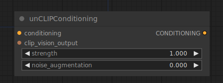

# unCLIP Conditioning

{ align=right width=450 }

The unCLIP Conditioning node can be used to provide unCLIP models with additional visual guidance through images encoded by a CLIP vision model. This node can be chained to provide multiple images as guidance.

!!! warning
    Not all diffusion models are compatible with unCLIP conditioning. This node specifically requires a a diffusion model that was made with unCLIP in mind.

## inputs

`conditioning`

:   The conditioning.

`clip_vision_output`

:   An image encoded by a CLIP VISION model.

`strength`

:   How strongly the unCLIP diffusion model should be guided by the image

`noise_augmentation`

:   Noise_augmentation can be used to guide the unCLIP diffusion model to random places in the neighborhood of the original CLIP vision embeddings, providing additional variations of the generated image closely related to the encoded image.

## outputs

`CONDITIONING`

:   A Conditioning containing additional visual guidance for unCLIP models.

## example

example usage text with workflow image