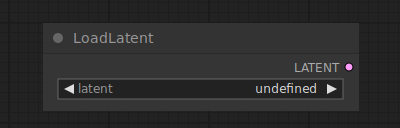

# Load Latent

{ align=right width=450 }

The Load Latent node can be used to to load latents that were saved with the [Save Latent](SaveLatent.md) node.

## inputs

`latent`

:   The name of the latent to load.

## outputs

`LATENT`

:   The latent image.

## example

example usage text with workflow image