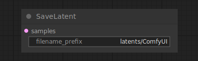

# Save Latent

{ align=right width=450 }

The Save Latent node can be used to to save latents for later use. These can then be loaded again using the [Load Latent](LoadLatent.md) node.

## inputs

`samples`

:   The latents to be saved.

`filename_prefix`

:   a prefix for the file name.

## outputs

This node has no outputs.

## example

example usage text with workflow image