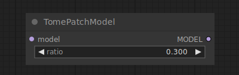

# Tome Patch Model

{ align=right width=450 }

The Tome Patch Model node can be used to apply Tome optimizations to the diffusion model. Tome (TOken MErging) tries to find a way to merge prompt tokens in such a way that the effect on the final image are minimal. This results in faster generation times and a reduction in required VRAM at the cost of a potential reduction in quality. This tradeoff can be controlled by the `ratio` setting, where higher values result in more tokens being merged

## inputs

`model`

:   The diffusion model for tome to be applied to.

`ratio`

:   The treshold to determine when to merge tokens.

## outputs

`MODEL`

:   The diffusion model optimized by tome.

## example

example usage text with workflow image