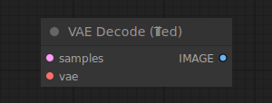

# VAE Decode (Tiled)

{ align=right width=450 }

The VAE Decode (Tiled) node can be used to decode latent space images back into pixel space images, using the provided VAE. This node decodes latents in tiles allowing it to decode larger latent images than the regular [VAE Decode](../Latent/VAEDecode.md) node.

!!! info
    When the regular VAE Decode node fails due to insufficient VRAM, comfy will automatically retry using the tiled implementation

## inputs

`samples`

:   The latent images to be decoded.

`vae`

:   The VAE to use for decoding the latent images.

## outputs

`IMAGE`

:   The decoded images.

## example

example usage text with workflow image