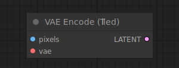

# VAE Encode (Tiled)

{ align=right width=450 }

The VAE Encode node can be used to encode pixel space images into latent space images, using the provided VAE. This node encodes images in tiles allowing it to encode larger images than the regular [VAE Encode](../Latent/VAEEncode.md) node.

!!! info
    When the regular VAE Encode node fails due to insufficient VRAM, comfy will automatically retry using the tiled implementation

## inputs

`pixels`

:   The pixel space images to be encoded.

`vae`

:   The VAE to use for encoding the pixel images.

## outputs

`LATENT`

:   The encoded latent images.

## example

example usage text with workflow image