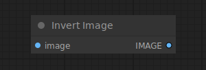

# Invert Image

{ align=right width=450 }

The Invert Image node can be used to to invert the colors of an image.

## inputs

`image`

:   The pixel image to be inverted.

## outputs

`IMAGE`

:   The inverted pixel image.

## example

example usage text with workflow image