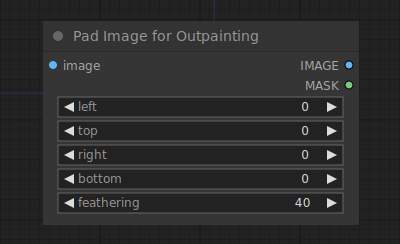

# Pad Image for Outpainting

{ align=right width=450 }

The Pad Image for Outpainting node can be used to to add padding to an image for outpainting. This image can then be given to an inpaint diffusion model via the [VAE Encode for Inpainting](../Latent/inpaint/VAEEncodeForInpainting.md).

## inputs

`image`

:   The image to be padded.

`left`

:   amount to pad left of the image.

`top`

:   amount to pad above the image.

`right`

:   amount to pad right of the image.

`bottom`

:   amount to pad below the image.

`feathering`

:   How much to feather the borders of the original image.

## outputs

`IMAGE`

:   The padded pixel image.

`MASK`

:   The mask indicating to the sampler where to outpaint.

## example

example usage text with workflow image