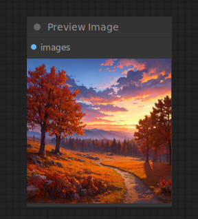

# Preview Image

{ align=right width=450 }

The Preview Image node can be used to preview images inside the node graph.

## inputs

`image`

:   The pixel image to preview.

## outputs

This node has no outputs.

## example

example usage text with workflow image