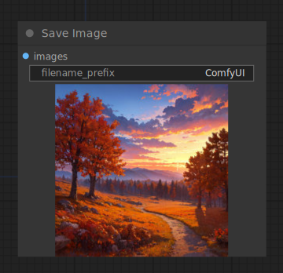

# Save Image

{ align=right width=450 }

The Save Image node can be used to save images. To simply preview an image inside the node graph use the [Preview Image](PreviewImage.md) node. It can be hard to keep track of all the images that you generate. To help with organizing your images you can pass specially formatted strings to an output node with a `file_prefix` widget. For more information about how to format your string see [this](../../Interface/SaveFileFormatting.md) page.

## inputs

`image`

:   The pixel image to preview.

`filename_prefix`

:   A prefix to put into the filename.

## outputs

This node has no outputs.

## example

example usage text with workflow image