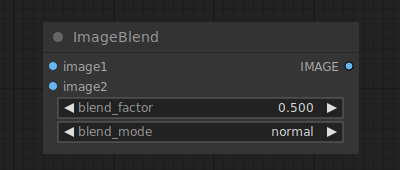

# Image Blend

{ align=right width=450 }

The Image Blend node can be used to blend two images together.

!!! info
    If the dimensions of the second image do not match those of the first it is rescaled and center-cropped to maintain its aspect ratio

## inputs

`image1`

:   A pixel image.

`image2`

:   A second pixel image.

`blend_factor`

:   The opacity of the second image.

`blend_mode`

:   How to blend the images.

## outputs

`IMAGE`

:   The blended pixel image.

## example

example usage text with workflow image