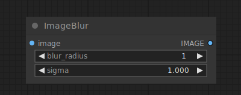

# Image Blur

{ align=right width=450 }

The Image Blend node can be used to apply a gaussian blur to an image.

## inputs

`image`

:   The pixel image to be blurred.

`blur_radius`

:   The radius of the gaussian.

`sigma`

:   The sigma of the gaussian, the smaller sigma is the more the kernel in concentrated on the center pixel.

## outputs

`IMAGE`

:   The blurred pixel image.

## example

example usage text with workflow image