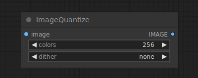

# Image Quantize

{ align=right width=450 }

The Image Quantize node can be used to quantize an image, reducing the number of colors in the image.

## inputs

`image`

:   The pixel image to be quantized.

`colors`

:   The number of colors in the quantized image.

`dither`

:   Wether to use dithering to make the quantized image look more smooth, or not.

## outputs

`IMAGE`

:   The quantized pixel image.

## example

example usage text with workflow image