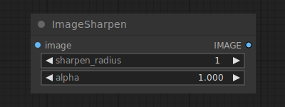

# Image Sharpen

{ align=right width=450 }

The Image Sharpen node can be used to apply a Laplacian sharpening filter to an image.

## inputs

`image`

:   The pixel image to be sharpened.

`sharpen_radius`

:   The radius of the sharpening kernel.

`sigma`

:   The sigma of the gaussian, the smaller sigma is the more the kernel in concentrated on the center pixel.

`alpha`

:   The strength of the sharpening kernel.

## outputs

`IMAGE`

:   The sharpened pixel image.

## example

example usage text with workflow image