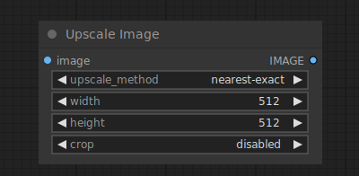

# Upscale Image

{ align=right width=450 }

The Upscale Image node can be used to resize pixel images. To upscale images using AI see the [Upscale Image Using Model](UpscaleImageUsingModel.md) node.

## inputs

`image`

:   The pixel images to be upscaled.

`upscale_method`

:   The method used for resizing.

`Width`

:   The target width in pixels.

`height`

:   The target height in pixels.

`crop`

:   Wether or not to center-crop the image to maintain the aspect ratio of the original latent images.

## outputs

`IMAGE`

:   The resized images.

## example

example usage text with workflow image