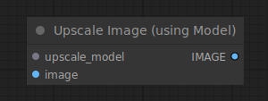

# Upscale Image (using Model)

{ align=right width=450 }

The Upscale Image (using Model) node can be used to upscale pixel images using a model loaded with the [Load Upscale Model](../../Loaders/LoadUpscaleModel.md) node.

## inputs

`upscale_model`

:   The model used for upscaling.

`image`

:   The pixel images to be upscaled.

## outputs

`IMAGE`

:   The upscaled images.

## example

example usage text with workflow image