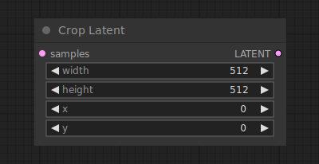

# Crop Latent

{ align=right width=450 }

The Crop latent node can be used to crop latents to a new shape.

!!! info
    The origin of the coordinate system in ComfyUI is at the top left corner.

## inputs

`samples`

:   The latents that are to be cropped.

`width`

:   The width of the area in pixels.

`height`

:   The height of the area in pixels.

`x`

:   The x coordinate of the area in pixels.

`y`

:   The y coordinate of the area in pixels.

## outputs

`LATENT`

:   The cropped latents.

## example

example usage text with workflow image