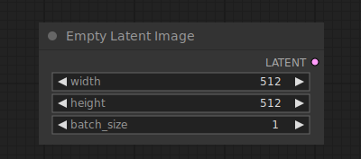

# Empty Latent Image

{ align=right width=450 }

The Empty Latent Image node can be used to create a new set of empty latent images. These latents can then be used inside e.g. a text2image workflow by noising and denoising them with a sampler node.

## inputs

`width`

:   The width of the latent images in pixels.

`height`

:   The height of the latent images in pixels.

`batch_size`

:   The number of latent images.

## outputs

`LATENT`

:   The empty latent images.

## example

example usage text with workflow image