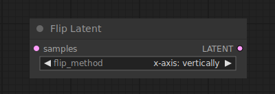

# Flip Latent

{ align=right width=450 }

The Flip latent node can be used to flip latents horizontally or vertically.

## inputs

`samples`

:   The latents that are to be flipped.

`flip_method`

:   Wether to flip the latents horizontally or vertically.

## outputs

`LATENT`

:   The flipped latents.

## example

example usage text with workflow image