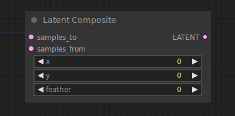

# Latent Composite

{ align=right width=450 }

The Latent Composite node can be used to paste one latent into another.

!!! info
    The origin of the coordinate system in ComfyUI is at the top left corner.

## inputs

`samples_to`

:   The latents to be pasted in.

`samples_from`

:   The latents that are to be pasted.

`x`

:   The x coordinate of the pasted latent in pixels.

`y`

:   The y coordinate of the pasted latent in pixels.

`feather`

:   Feathering for the latents that are to be pasted.

## outputs

`LATENT`

:   A new latent composite containing the `samples_from` pasted into `samples_to`.

## example

example usage text with workflow image