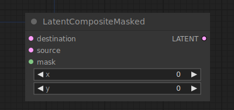

# Latent Composite Masked

{ align=right width=450 }

The Latent Composite Masked node can be used to paste a masked latent into another.

!!! info
    The origin of the coordinate system in ComfyUI is at the top left corner.

## inputs

`destination`

:   The latents to be pasted in.

`source`

:   The latents that are to be pasted.

`mask`

:   The mask for the source latents that are to be pasted.

`x`

:   The x coordinate of the pasted latent in pixels.

`y`

:   The y coordinate of the pasted latent in pixels.

## outputs

`LATENT`

:   A new latent composite containing the `source` latents pasted into the `destination` latents.

## example

example usage text with workflow image