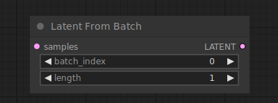

# Latent From Batch

{ align=right width=450 }

The Latent From Batch node can be used to pick a slice from a batch of latents. This is useful when a specific latent image or images inside the batch need to be isolated in the workflow.

## inputs

`samples`

:   The batch of latent images to pick a slice from.

`batch_index`

:   The index of the first latent image to pick.

`length`

:   How many latent images to take.

## outputs

`LATENT`

:   A new batch of latent images only containing the slice that was picked.

## example

example usage text with workflow image