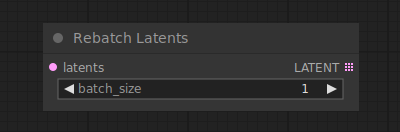

# Rebatch Latents

{ align=right width=450 }

The Rebatch latents node can be used to split or combine batches of latent images. When this results in multiple batches the node will output a list of batches instead of a single batch. This is useful e.g. to split batches up when the batch size is too big for all of them to fit inside VRAM, as ComfyUI will execute nodes for every batch in the list, rather than all at once. It can also be used merge lists of batches back together into a single batch.

!!! info
    The output of this node is a list, read [this]() page for more info about lists in comfy. TODO:figure out when and where to explain this.

## inputs

`samples`

:   The latent images that are to be rebatched.

`batch_size`

:   The new batch size.

## outputs

`LATENT`

:   A list of latents where each batch is no larger than `batch_size`.

## example

example usage text with workflow image