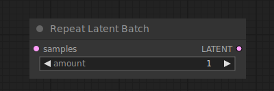

# Repeat Latent Batch

{ align=right width=450 }

The Repeat Latent Batch node can be used to repeat a batch of latent images. This can e.g. be used to create multiple variations of an image in an image to image workflow.

## inputs

`samples`

:   The batch of latent images that are to be repeated.

`amount`

:   The number of repeats.

## outputs

`LATENT`

:   A new batch of latent images, repeated `amount` times.

## example

example usage text with workflow image