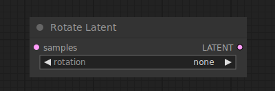

# Rotate Latent

{ align=right width=450 }

The Rotate Latent node can be used to rotate latent images clockwise in increments of 90 degrees.

## inputs

`samples`

:   The latent images to be rotated.

`rotation`

:   Clockwise rotation.

## outputs

`LATENT`

:   The rotated latents.

## example

example usage text with workflow image