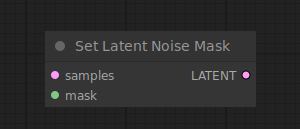

# Set Latent Noise Mask

{ align=right width=450 }

The Set Latent Noise Mask node can be used to add a mask to the latent images for inpainting. When the noise mask is set a sampler node will only operate on the masked area. If a single mask is provided, all the latents in the batch will use this mask.

## inputs

`samples`

:   The latent images to be masked for inpainting.

`mask`

:   The mask indicating where to inpaint.

## outputs

`LATENT`

:   The masked latents.

## example

example usage text with workflow image