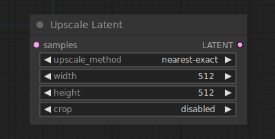

# Upscale Latent

{ align=right width=450 }

The Upscale Latent node can be used to resize latent images. 

!!! warning
    Resizing latent images is not the same as resizing pixel images. Naively resizing the latents rather than the pixels results in more artifacts.

## inputs

`samples`

:   The latent images to be upscaled.

`upscale_method`

:   The method used for resizing.

`Width`

:   The target width in pixels.

`height`

:   The target height in pixels.

`crop`

:   Wether or not to center-crop the image to maintain the aspect ratio of the original latent images.

## outputs

`LATENT`

:   The resized latents.

## example

example usage text with workflow image