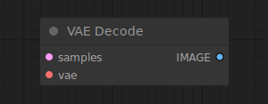

# VAE Decode

{ align=right width=450 }

The VAE Decode node can be used to decode latent space images back into pixel space images, using the provided VAE.

## inputs

`samples`

:   The latent images to be decoded.

`vae`

:   The VAE to use for decoding the latent images.

## outputs

`IMAGE`

:   The decoded images.

## example

example usage text with workflow image