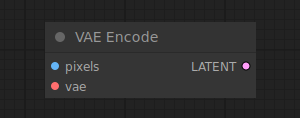

# VAE Encode

{ align=right width=450 }

The VAE Encode node can be used to encode pixel space images into latent space images, using the provided VAE.

## inputs

`pixels`

:   The pixel space images to be encoded.

`vae`

:   The VAE to use for encoding the pixel images.

## outputs

`LATENT`

:   The encoded latent images.

## example

example usage text with workflow image