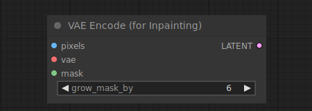

# VAE Encode For Inpainting

{ align=right width=450 }

The VAE Encode For Inpainting node can be used to encode pixel space images into latent space images, using the provided VAE. It also takes a mask for inpainting, indicating to a sampler node which parts of the image should be denoised. The area of the mask can be increased using `grow_mask_by` to provide the inpainting process with some additional padding to work with.

## inputs

`pixels`

:   The pixel space images to be encoded.

`vae`

:   The VAE to use for encoding the pixel images.

`mask`

:   The mask indicating where to inpaint.

`grow_mask_by`

:   How much to increase the area of the given mask.

## outputs

`LATENT`

:   The masked and encoded latent images.

## example

example usage text with workflow image