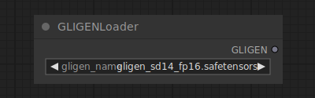

# GLIGEN Loader

{ align=right width=450 }

The GLIGEN Loader node can be used to load a specific GLIGEN model. GLIGEN models are used to associate spatial information to parts of a text prompt, guiding the diffusion model to generate images adhering to compositions specified by GLIGEN.

## inputs

`gligen_name`

:   The name of the GLIGEN model.

## outputs

`GLIGEN`

:   The GLIGEN model used to encode spatial information to parts of the text prompt.

## example

example usage text with workflow image