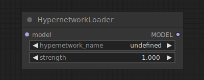

# Hypernetwork Loader

{ align=right width=450 }

The Hypernetwork Loader node can be used to load a hypernetwork. similar to LoRAs, they are used to modify the diffusion model, to alter the way in which latents are denoised. Typical use-cases include adding to the model the ability to generate in certain styles, or better generate certain subjects or actions. One can even chain multiple hypernetworks together to further modify the model.

!!! tip

    Hypernetwork strength values can be set to negative values. At times this can result in interesting effects.

## inputs

`model`

:   A diffusion model.

`hypernetwork_name`

:   The name of the hypernetwork.

`strength`

:   How strongly to modify the diffusion model. This value can be negative.

## outputs

`MODEL`

:   The modified diffusion model.

## example

example usage text with workflow image