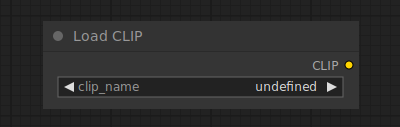

# Load CLIP

{ align=right width=450 }

The Load CLIP node can be used to load a specific CLIP model, CLIP models are used to encode text prompts that guide the diffusion process.

!!! warning

    Conditional diffusion models are trained using a specific CLIP model, using a different model than the one which it was trained with is unlikely to result in good images. The [Load Checkpoint](LoadCheckpoint.md) node automatically loads the correct CLIP model.

## inputs

`clip_name`

:   The name of the CLIP model.

## outputs

`CLIP`

:   The CLIP model used for encoding text prompts.

## example

example usage text with workflow image