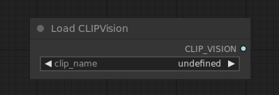

# Load CLIP Vision

{ align=right width=450 }

The Load CLIP Vision node can be used to load a specific CLIP vision model, similar to how CLIP models are used to encode text prompts, CLIP vision models are used to encode images.

## inputs

`clip_name`

:   The name of the CLIP vision model.

## outputs

`CLIP_VISION`

:   The CLIP vision model used for encoding image prompts.

## example

example usage text with workflow image