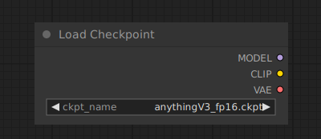

# Load Checkpoint

{ align=right width=450 }

The Load Checkpoint node can be used to load a diffusion model, diffusion models are used to denoise latents. This node will also provide the appropriate VAE and CLIP model.

## inputs

`ckpt_name`

:   The name of the model.

## outputs

`MODEL`

:   The model used for denoising latents.

`CLIP`

:   The CLIP model used for encoding text prompts.

`VAE`

:   The VAE model used for encoding and decoding images to and from latent space.

## example

example usage text with workflow image