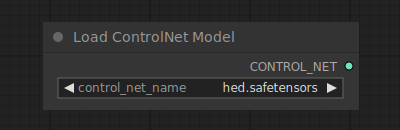

# Load ControlNet Model

{ align=right width=450 }

The Load ControlNet Model node can be used to load a ControlNet model. Similar to how the CLIP model provides a way to give textual hints to guide a diffusion model, ControlNet models are used to give visual hints to a diffusion model. This process is different from e.g. giving a diffusion model a partially noised up image to modify. Instead ControlNet models can be used to tell the diffusion model e.g. where edges in the final image should be, or how subjects should be posed. This node can also be used to load T2IAdaptors.

## inputs

`control_net_name`

:   The name of the ControlNet model.

## outputs

`CONTROL_NET`

:   The ControlNet or T2IAdaptor model used for providing visual hints to a diffusion model.

## example

example usage text with workflow image