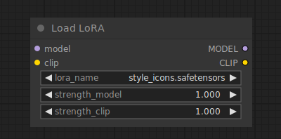

# Load LoRA

{ align=right width=450 }

The Load LoRA node can be used to load a LoRA. LoRAs are used to modify the diffusion and CLIP models, to alter the way in which latents are denoised. Typical use-cases include adding to the model the ability to generate in certain styles, or better generate certain subjects or actions. One can even chain multiple LoRAs together to further modify the model.

!!! tip

    LoRA strength values can be set to negative values. At times this can result in interesting effects.

## inputs

`model`

:   A diffusion model.

`clip`

:   A CLIP model.

`lora_name`

:   The name of the LoRA.

`strength_model`

:   How strongly to modify the diffusion model. This value can be negative.

`strength_clip`

:   How strongly to modify the CLIP model. This value can be negative.

## outputs

`MODEL`

:   The modified diffusion model.

`CLIP`

:   The modified CLIP model.

## example

example usage text with workflow image