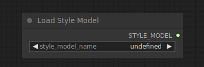

# Load Style Model

{ align=right width=450 }

The Load Style Model node can be used to load a Style model. Style models can be used to provide a diffusion model a visual hint as to what kind of style the denoised latent should be in.

!!! info
    Only T2IAdaptor style models are currently supported

## inputs

`style_model_name`

:   The name of the style model.

## outputs

`STYLE_MODEL`

:   The style model used for providing visual hints about the desired style to a diffusion model.

## example

example usage text with workflow image